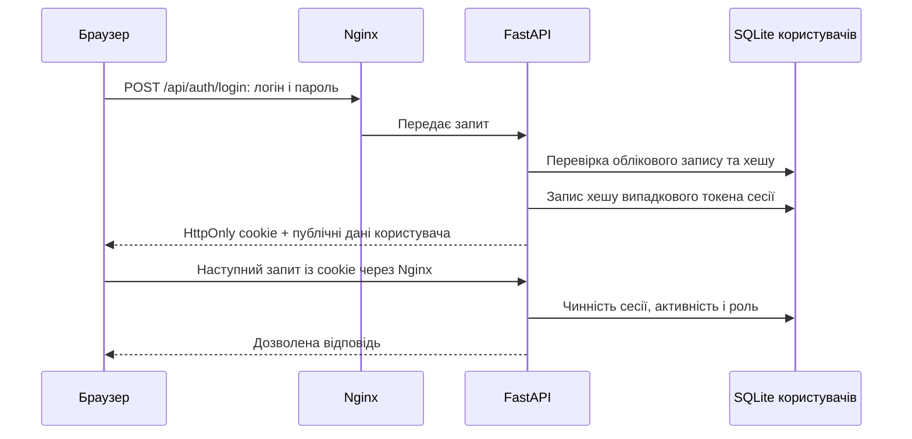

# Вхід, журнали та перехід на корпоративні облікові записи

Документ звірено з кодом і локальним розгортанням **4 жовтня 2026 року**. Слово «логування» тут розділено на дві теми: **вхід користувача** та **запис технічних подій у журнали**. Поточний вхід використовує локальні облікові записи. Підключення Keycloak, Active Directory або Microsoft Entra ID до входу в інтерфейс ще не реалізоване; нижче наведено план такого переходу.

## 1. Як зараз організовано вхід



### Модулі та відповідальність

| Де | Що виконує |
| --- | --- |
| `backend/app/core/user_accounts.py` | Облікові записи, перевірка паролів, сесії, ролі, обмеження спроб входу, перевірка походження запитів і персональні налаштування. |
| `backend/app/api/account_routes.py` | `/api/auth/session`, `/api/auth/login`, `/api/auth/logout`; `/api/me/dashboard`; адміністративні `/api/admin/users`. Відповіді мають `Cache-Control: no-store`; помилки перевірки форм не повертають введені паролі. |
| `backend/app/api/configuration_routes.py` | Перевіряє право адміністрування спільної конфігурації через сесію адміністратора або окремий адміністративний ключ. |
| `backend/app/main.py` | Підключає перевірку доступу до маршрутизатора аналітики; `/api/health` залишається відкритим. |
| `frontend/src/config/AuthContext.tsx` | Перевіряє сесію при відкритті, кожні 30 секунд і при поверненні до вкладки; обробляє вхід і вихід. При зміні користувача очищає кеш даних та завантажує відповідну конфігурацію. |
| `frontend/src/lib/accountApi.ts` | Надсилає cookie через `credentials: include`. Для особистого дашборду додає очікуваний `X-Analytics-User-Id`, щоб інша вкладка не могла зберегти налаштування попереднього користувача після зміни спільної cookie. Заголовок перевіряє особу, а не обирає чужий обліковий запис. |
| `nginx/default.conf` | Передає `/api/` до backend, зберігаючи зовнішній `Host` із портом; передає `X-Forwarded-For` та `X-Forwarded-Proto`. |

До першого облікового запису застосунок підтримує початкове налаштування без входу. Першого адміністратора створюють із серверним ключем `APP_ADMIN_TOKEN`. Після цього стан `account_state.ever_enabled` зберігає вимогу входу: вимкнення користувачів не відкриває анонімний доступ. Без входу аналітичні API повертають `401`, а `/api/app-configuration` віддає безпечні початкові параметри й публічні назву та підзаголовок. При недоступності сховища доступ відхиляється.

### Паролі, сесії та права

Паролі користувачів не записуються у відкритому вигляді до бази або звичайних журналів входу. SQLite містить **PBKDF2-HMAC-SHA256 із 600 000 ітерацій**, окремою випадковою 32-байтовою сіллю та результатом хешування. Пароль перевіряється на сервері; його старе значення відновити через інтерфейс неможливо. Такий параметр PBKDF2 відповідає наведеному OWASP мінімуму для HMAC-SHA256. [OWASP: Password Storage](https://cheatsheetseries.owasp.org/cheatsheets/Password_Storage_Cheat_Sheet.html).

У браузері зберігається випадковий непрозорий токен у cookie `analytics_session`: `HttpOnly`, `SameSite=Strict`, `Path=/`, строк до **8 годин**. У таблиці `sessions` записано тільки SHA-256 токена, локальний `user_id`, версію авторизації та часові позначки. Токен не містить ролі чи персональних даних. Вихід відкликає поточну сесію; вимкнення облікового запису, зміна ролі або пароля відкликають усі його сесії. Вхід повторно з того самого браузера замінює попередню cookie.

Роль `viewer` дозволяє перегляд даних і налаштування власного дашборду; `administrator` також дозволяє керувати користувачами та спільною конфігурацією. Останнього активного адміністратора не можна вимкнути або позбавити цієї ролі. Індивідуального обмеження видимих записів за підрозділами зараз немає.

`APP_ADMIN_TOKEN` — окремий привілейований серверний секрет для початкового налаштування й відновлення доступу. Він передається через `X-App-Admin-Token`, може авторизувати адміністративні операції та доступ до аналітики й не представляє конкретну людину. При ручному введенні інтерфейс тимчасово тримає його в `sessionStorage`; звичайний користувацький вхід цього ключа не потребує. Ключ керування кешем є окремим механізмом і сам по собі не дає права змінювати спільні налаштування.

Для запитів, що змінюють стан через cookie, сервер перевіряє `Origin`, з резервною перевіркою `Referer`, проти адреси застосунку та дозволених `API_CORS_ORIGINS`. Відсутність обох заголовків у запиті з cookie відхиляється. `Secure` вмикається для HTTPS або через `APP_SESSION_COOKIE_SECURE=true`. Якщо HTTPS завершується на зовнішньому проксі, потрібно явно налаштувати цей параметр і довіру до проксі. Поточний локальний Compose відкриває HTTP на порту 8080; це не опис готової корпоративної HTTPS-конфігурації.

### Де зберігаються дані

| Об’єкт | Сховище |
| --- | --- |
| Користувачі, хеші паролів, сесії, особисті дашборди, лічильники входу | `APP_USERS_DB`, у поточному Compose `/app/data/app_users.sqlite3`. |
| Спільні параметри, чернетка, історія версій | `APP_CONFIGURATION_DB`, у поточному Compose `/app/data/app_configuration.sqlite3`. |
| Постійне збереження обох баз | Іменований Docker том `app_configuration_data`, підключений до `/app/data`. |

Перезапуск і перебудова контейнерів зберігають том. Його резервна копія потрібна і для користувачів, і для налаштувань. Видалення тому видаляє ці дані. База SQLite сама по собі не зашифрована: доступ і шифрування носія забезпечує середовище розгортання. Деталі керування користувачами описано в [інструкції облікових записів](user-accounts.md).

Службові матеріали локального налаштування або тестування в `.local` можуть містити початкові дані для входу у відкритому вигляді. Це окремі приватні файли, а не штатне збереження паролів застосунком. Каталог виключено з Git і Docker-збірки; доступ до нього потрібно обмежити, а такі файли — прибрати після передачі даних власнику або завершення перевірки. Їхній вміст не додають до документації, журналів і звітів.

### Keycloak

Старий сервісний OAuth-клієнт (`client_credentials`) для Accessor видалено разом з уходом від зовнішніх джерел даних. Вхід користувачів через внутрішній Keycloak (SSO) ще планується; наразі використовуються локальні облікові записи в SQLite.

## 2. Які журнали зараз є

| Джерело | Що є зараз | Чого воно не доводить |
| --- | --- | --- |
| Uvicorn / backend | Стандартні записи HTTP-запитів: метод, URL, код відповіді, адреса клієнта; повідомлення запуску та помилки серверних модулів. | Конкретну особу, причину зміни прав чи повну послідовність адміністративних дій. |
| Nginx | Стандартні журнали HTTP-доступу й помилок проксі. | Авторизацію людини на рівні застосунку. |
| Python `logging` | Наприклад, помилки прогріву кешу, читання конфігурації й джерела даних. | Повний журнал безпеки входу або змін користувачів. |
| `configuration_versions` | Номер версії, час, тип `initial` / `publish` / `rollback` і знімок конфігурації. | Хто саме зробив зміну: `actor_user_id` тут відсутній. Збереження чернетки не є окремою подією цієї історії. |
| `login_attempts` | Лічильники для обмеження входу: 10 спроб на логін і 50 на адресу клієнта, яку бачить backend, за 15 хвилин; ключі областей хешуються. | Історію входів: вікна очищаються, а після успіху лічильник логіна видаляється. |
| `sessions` | Реєстр виданих сесій із строком дії. | Незмінний архів входів/виходів: сесії відкликаються та очищаються. |

Отже, **окремого журналу безпеки з автором події зараз немає**. Код успішного `/auth/login` або відмови у звичайному HTTP-журналі допомагає діагностиці, але не замінює аудит. Стандартне HTTP-логування Uvicorn керується його параметрами `--log-config`, `--log-level`, `--no-access-log`; у поточному Dockerfile вони не перевизначені. Перед корпоративним розгортанням також потрібно перевірити довіру до адрес проксі: наявність `X-Forwarded-For` сама по собі не гарантує, що backend використовує адресу людини для журналів та обмеження входу. [Uvicorn: Settings](https://www.uvicorn.org/settings/).

У перевіреному локальному розгортанні всі три контейнери використовують Docker `json-file`, без заданих `max-size` і `max-file`. У Compose немає власного розділу `logging`, централізованого збору, строку зберігання чи архівування журналів. Це окрема задача для корпоративного розгортання; Docker описує налаштування драйверів і ротації у [Configure logging drivers](https://docs.docker.com/engine/logging/configure/).

Звичайні журнали HTTP не містять тіла форми входу за поточною конфігурацією. Однак діагностичні помилки інших модулів можуть містити текст відповіді джерела, фрагмент SQL або URL із параметрами. Старий Accessor-клієнт також має таке діагностичне повідомлення. Тому весь файл журналу не слід вважати очищеним від приватних даних.

### Безпечний приклад перегляду подій входу

Наведений PowerShell-приклад не читає `.env`, бази, cookie чи файли з паролями. Він відбирає лише відомі маршрути входу й особистого дашборду та друкує **час, метод, шлях без параметрів і код відповіді**. Інші записи, адреси клієнтів, тіла помилок і заголовки не виводяться:

```powershell
Set-Location -LiteralPath 'C:\Users\Kremero\DB\analytics-ui-starter\analytics-ui-starter'
docker compose logs --since 30m --tail 300 --timestamps backend |
  ForEach-Object {
    if ($_ -match '(?<utc>\d{4}-\d{2}-\d{2}T\S+).*"(?<method>GET|POST|PUT|PATCH|DELETE) (?<path>/api/(?:auth/(?:session|login|logout)|me/dashboard))(?:\?[^ "\s]*)? HTTP/[0-9.]+" (?<status>\d{3})') {
      '{0} {1} {2} {3}' -f $Matches.utc, $Matches.method, $Matches.path, $Matches.status
    }
  }
```

Параметри `--since`, `--tail` і `--timestamps` описано в [Docker Compose logs](https://docs.docker.com/reference/cli/docker/compose/logs/). Цей перегляд є технічною діагностикою; зіставити запит із конкретним користувачем він не дозволяє.

## 3. План переходу на Keycloak або корпоративний каталог

**Усі зміни в цьому розділі — майбутня реалізація. Зараз немає OIDC-адаптера, callback-маршрутів, таблиці прив’язки зовнішніх ідентичностей або змінної вибору провайдера.**

### Варіанти інтеграції

| Що вже є в організації | Запропонований шлях |
| --- | --- |
| Keycloak | Застосунок входить через OIDC до окремого realm/client Keycloak. |
| Локальний Windows Server Active Directory Domain Services | Keycloak підключає каталог через LDAP User Federation; застосунок залишається OIDC-клієнтом Keycloak. Паролі домену не передаються нашому frontend/backend. |
| Microsoft Entra ID | Зареєструвати Web application у потрібному tenant; застосунок може використовувати Entra безпосередньо як OIDC-провайдера або через Keycloak, якщо організація вже централізує провайдери там. |

Keycloak підтримує федерацію LDAP і Active Directory. Для такого варіанта узгоджуються адреса каталогу, TLS/сертифікати, службовий bind-обліковий запис із потрібними правами, область пошуку користувачів і зіставлення груп. Це налаштування Keycloak, а не прямий LDAP-вхід у React. [Keycloak: Server Administration Guide, LDAP and Active Directory](https://www.keycloak.org/docs/latest/server_admin/).

AD DS і Microsoft Entra ID — різні системи: перша обслуговує домен і традиційні LDAP/Kerberos-сценарії, друга є хмарним провайдером ідентичності. Назву «AD» потрібно уточнити перед підключенням. [Microsoft: Compare Active Directory to Microsoft Entra ID](https://learn.microsoft.com/en-us/entra/fundamentals/compare). Для Entra доступні OIDC discovery, авторизація, обмін коду й ключі підпису; у плані потрібен конкретний дозволений tenant. [Microsoft: OpenID Connect](https://learn.microsoft.com/en-us/entra/identity-platform/v2-protocols-oidc).

### Як запропоновано змінити застосунок

1. **Додати серверний адаптер провайдера.** Зберегти локальну перевірку як окремий варіант і додати OIDC-адаптер, що повертає перевірену зовнішню особу до спільного шару локальних користувачів і сесій. Браузер переходить на сторінку провайдера, а backend обмінює повернений код. Для цього проєкту пропонується Authorization Code із PKCE `S256`, `state` і `nonce`; секрет confidential client залишається на сервері. [Keycloak: Authorization Code](https://www.keycloak.org/securing-apps/oidc-layers), [RFC 7636: PKCE](https://www.rfc-editor.org/rfc/rfc7636), [RFC 9700: OAuth Security](https://www.rfc-editor.org/rfc/rfc9700).
2. **Додати початок входу й callback.** Наприклад, майбутні `/api/auth/oidc/start` і `/api/auth/oidc/callback`. Зареєструвати точну HTTPS callback-адресу. Backend перевіряє одноразовість і прив’язку запиту, підпис ID token, очікувані `iss`, `aud`/`azp`, строк дії та `nonce`, використовуючи перевірену OIDC-бібліотеку й ключі провайдера. [OpenID Connect Core: ID Token validation](https://openid.net/specs/openid-connect-core-1_0.html).
3. **Врахувати cookie під час повернення від провайдера.** Поточна `SameSite=Strict` не надсилається при переході з іншого сайту. Для майбутнього callback потрібна окрема короткочасна прив’язка запиту: наприклад, захищена `HttpOnly` correlation-cookie із `SameSite=Lax` для GET callback та одноразовим серверним станом. Після перевірки видається звичайна сесія застосунку. Це проєктне рішення потребує реалізації й тестування; нинішні перевірки `Origin` також не можна без змін застосувати до зовнішнього callback.
4. **Зберегти локальний ID і особисті налаштування.** Запропонована таблиця `external_identities(issuer, subject, user_id)` із унікальністю `(issuer, subject)` прив’язує перевірені `iss` і `sub` до вже наявного `users.id`. Тоді `dashboard_preferences.user_id` не змінюється. У OIDC стабільна ідентифікація спирається на issuer і subject; email та username можуть змінюватися. [OpenID Connect Core: subject identifiers and claim stability](https://openid.net/specs/openid-connect-core-1_0.html).
5. **Прив’язувати наявних людей із підтвердженням.** Не об’єднувати облікові записи автоматично через однаковий логін чи email. Потрібні підтвердження власника або контрольована адміністративна процедура. Для нових зовнішніх користувачів слід додати тип облікового запису без локального пароля; чинна схема вимагає `password_hash`, тому її доведеться змінити міграцією. Локальні паролі не переносяться до провайдера цим планом.
6. **Узгодити права та завершення доступу.** Явно зіставити дозволені групи/ролі провайдера з `viewer` і `administrator`; не давати адміністрування будь-якій довільній групі. Зберегти перевірки на backend, захист останнього адміністратора й відновлення доступу. Окремо реалізувати реакцію на блокування в каталозі, зміни ролей, logout провайдера та відкликання локальних сесій. Нинішні 8 годин локальної сесії не забезпечують автоматичного миттєвого відкликання в зовнішньому каталозі.

Майбутні параметри можна організувати як `AUTH_PROVIDER`, `OIDC_ISSUER`, `OIDC_CLIENT_ID`, `OIDC_CLIENT_SECRET`, `OIDC_REDIRECT_URI` та явне зіставлення ролей. **Зараз код ці назви не читає: додавання їх у `.env` не ввімкне SSO.** Realm, tenant, секрети й адреси мають надходити з керованої серверної конфігурації, а не з користувацької форми чи звіту.

### Що додати до журналів разом із SSO

Провайдер має відповідати за події перевірки особи, а застосунок — за свої дозволи та дії. Для майбутнього аудиту застосунку пропонується окреме сховище подій із часом UTC, `actor_user_id`, способом входу, типом дії, безпечним ID об’єкта, результатом і `request_id`. Потрібні події входу/відмови/виходу, створення та зміни доступу, зміни ролі й прив’язки зовнішньої особи, публікації й відновлення спільної конфігурації. Для операцій зі старим ключем треба вказувати окремого службового автора, а не вигадувати користувача.

Паролі, cookie, authorization codes, ID/access/refresh tokens та заголовки авторизації до аудиту не потрапляють. Для майбутнього OIDC callback слід прибрати параметри коду й стану з HTTP-журналів. Строк зберігання, доступ до журналів, ротація та централізований збір задаються окремо; це не замінює резервування бази налаштувань.

У Keycloak user events та admin events налаштовуються окремо; повне збереження подій потрібно явно ввімкнути й задати строк утримання. Вони доповнюють аудит застосунку, оскільки провайдер не бачить його внутрішніх дій. [Keycloak: Configuring auditing to track events](https://www.keycloak.org/docs/latest/server_admin/).

### Послідовність міграції для цього проєкту

Спочатку уточнити систему організації й адресу HTTPS, потім підготувати тестовий client/realm або tenant. Далі реалізувати серверний OIDC-адаптер, прив’язку зовнішніх осіб до локальних ID, зіставлення прав і журнал аудиту. На тестовому середовищі перевірити вхід, вихід, блокування, зміни груп, ізоляцію дашбордів, callback і роботу резервного адміністратора. Після підтвердження збереження наявних налаштувань перевести користувачів на корпоративний вхід і окремо вирішити, кому залишити локальний доступ. Поточний локальний вхід продовжує працювати до такої реалізації.
